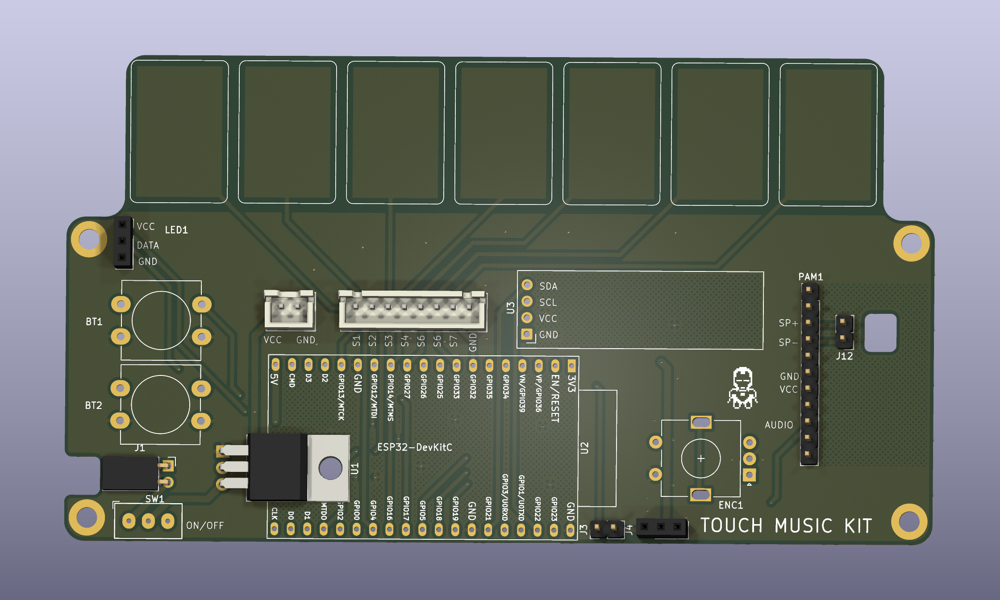

# Touch Music Kit

Touch Music Kit is an ESP32-based music controller PCB with seven capacitive touch pads, a small OLED display, physical controls, addressable LED output, and a PAM8403 audio amplifier module interface.



## Features

- ESP32-DevKitC module as the main controller.
- Seven on-board capacitive touch pads labeled `S1` through `S7`.
- 0.91 inch SSD1306 I2C OLED module.
- Rotary encoder with integrated push switch.
- Two 12 mm push buttons.
- Slide power switch and power input connectors.
- PAM8403 amplifier module header for audio output.
- Speaker output intended for a 0.5 W, 8 ohm, 32 mm speaker through the PAM8403 module.
- NeoPixel-compatible 3-pin LED header.
- LM1117T-3.3 regulator footprint.
- KiCad project files plus fabrication outputs for board manufacturing.

## Repository Layout

```text
.
|-- hardware/
|   `-- touch-kit/
|       |-- music-kit.kicad_pro
|       |-- music-kit.kicad_sch
|       |-- music-kit.kicad_pcb
|       `-- *_production/
|           `-- dated export folder/
|               |-- Gerber ZIP
|               |-- BOM CSV
|               |-- position CSV
|               `-- IPC netlist
|-- media/
|   `-- pcb-front-render.png
`-- software/
```

The `software/` directory is currently empty.

## Hardware Overview

| Designator | Part / Module | Notes |
| --- | --- | --- |
| `U2` | ESP32-DevKitC | Main controller module. |
| `U3` | ER_OLEDM0.91_1x-I2C | 0.91 inch, 128x32, SSD1306 I2C OLED. |
| `ENC1` | EC11-style rotary encoder | Encoder with push switch. |
| `BT1`, `BT2` | 12 mm push buttons | User input buttons. |
| `J5` | JST-XH 1x08 input connector | Breaks out `S1` through `S7` plus `GND`. |
| `LED1` | 3-pin NeoPixel header | `VCC`, `DATA`, `GND`. |
| `PAM1` | PAM8403 module header | 1x11 header with audio output, DAC input, power, and ground nets. |
| `J4` | 3-pin DAC/audio header | `DAC_OUT`, `VCC`, and `GND`; schematic value is `Speakerdf`. |
| `J1`, `J6` | Power connectors | Auxiliary power and JST-XH power input. |
| `SW1` | Slide switch | Board on/off switch. |
| `U1` | LM1117T-3.3 | 3.3 V regulator footprint. |

The board outline is approximately 134 mm x 75 mm, based on the KiCad edge cuts and dimension markings.

## Firmware Pin Map

This map is derived from the KiCad PCB nets connected to `U2` (`ESP32-DevKitC`).

| Signal | ESP32 GPIO | Purpose |
| --- | ---: | --- |
| `S1` | GPIO4 | Capacitive touch input |
| `S2` | GPIO15 | Capacitive touch input |
| `S3` | GPIO13 | Capacitive touch input |
| `S4` | GPIO14 | Capacitive touch input |
| `S5` | GPIO27 | Capacitive touch input |
| `S6` | GPIO33 | Capacitive touch input |
| `S7` | GPIO32 | Capacitive touch input |
| `DAC_MCU` | GPIO25 | ESP32 DAC/audio signal |
| `WS_DATA` | GPIO26 | NeoPixel data |
| `BT1` | GPIO16 | Push button 1 |
| `BT2` | GPIO17 | Push button 2 |
| `ENC_SW` | GPIO5 | Encoder switch |
| `ENC_DT` | GPIO18 | Encoder data |
| `ENC_CLK` | GPIO19 | Encoder clock |
| `SDA` | GPIO21 | OLED I2C data |
| `SCL` | GPIO22 | OLED I2C clock |

Note: the current PCB silkscreen labels the fifth and sixth input positions as `S6`, `S6`. The KiCad nets show those positions as `S5` and `S6`, so verify the board file before ordering or assembling.

## Manufacturing Files

Open the KiCad project from:

```text
hardware/touch-kit/music-kit.kicad_pro
```

Ready-to-send fabrication outputs are under the production export folder in `hardware/touch-kit/`. The current export can be found with:

```text
hardware/touch-kit/*_production/2026-07-02-17-41-01/
```

That folder includes the Gerber ZIP, BOM CSV, position CSV, and IPC netlist generated from the KiCad PCB. If you change the schematic or PCB, regenerate the manufacturing files from KiCad before ordering.

## Assembly Notes

- Confirm `VCC`, `+BATT`, and `GND` with a multimeter before plugging in the ESP32, OLED, or amplifier module.
- Install the ESP32-DevKitC, OLED, PAM8403 module, buttons, encoder, headers, and power connectors according to the silkscreen and BOM.
- Use the PAM8403 module with the knob-style amplifier header expected by `PAM1`.
- Connect the speaker through the PAM8403 module output pins marked `SP+` and `SP-`; do not assume `J4` is the raw speaker output without checking the board file.
- The NeoPixel header `LED1` is labeled `VCC`, `DATA`, `GND`; data is driven by `WS_DATA` / GPIO26.

## Firmware Status

Firmware is not included yet. A firmware project should initialize:

- ESP32 capacitive touch readings for `S1` through `S7`.
- SSD1306 display over I2C on GPIO21/GPIO22.
- Audio or DAC output on GPIO25.
- NeoPixel output on GPIO26.
- Button and encoder inputs on GPIO16, GPIO17, GPIO5, GPIO18, and GPIO19.

## License

This project is licensed under the MIT License. See [LICENSE](LICENSE).
